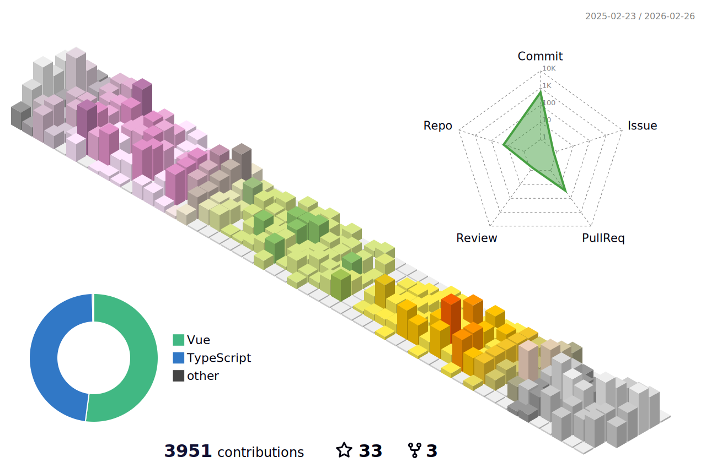

## Hi, I am JJ! 
### Mechatronics Engineer | Software Developer | Astrophotographer

 
   
  
  
  
  

 

<picture>
  <source
    media="(prefers-color-scheme: dark)"
    srcset="https://raw.githubusercontent.com/ripwords/snk/output/github-contribution-grid-snake-dark.svg"
  />
  <source
    media="(prefers-color-scheme: light)"
    srcset="https://raw.githubusercontent.com/ripwords/snk/output/github-contribution-grid-snake.svg"
  />
  
</picture>

<!-- GitHub Activity Graph -->
<table align="center">
  <tr>
    <td colspan="2">
      
    </td>
  </tr>
</table>
