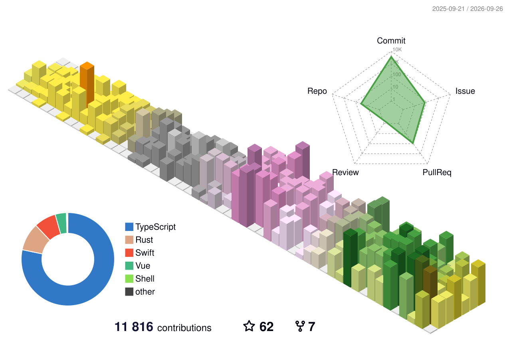

## Hi, I'm [JJ](http://jjteoh.com/)!
### Mechatronics Engineer | Software Developer | Astrophotographer

[](https://user-badge.committers.top/malaysia_private/Ripwords)

<div> 
  <picture>
  <source
    media="(prefers-color-scheme: dark)"
    srcset="https://github.com/Ripwords/Ripwords/blob/output/github-contribution-grid-snake-dark.svg"
  />
  <source
    media="(prefers-color-scheme: light)"
    srcset="https://github.com/Ripwords/Ripwords/blob/output/github-contribution-grid-snake.svg"
  />
  
</picture>

<br>


<br>

<picture>
  <source
    media="(prefers-color-scheme: dark)"
    srcset="./profile-3d-contrib/profile-night-rainbow.svg"
  />
  <source
    media="(prefers-color-scheme: light)"
    srcset="./profile-3d-contrib/profile-season-animate.svg"
  />
  
</picture>

<!--START_SECTION:waka-->

```txt
From: 19 August 2026 - To: 26 August 2026

TypeScript   13 hrs 43 mins        ████████▒░░░░░░░░░░░░░░░░   33.19 %
Markdown     10 hrs 24 mins        ██████▒░░░░░░░░░░░░░░░░░░   25.20 %
Vue          5 hrs 40 mins         ███▒░░░░░░░░░░░░░░░░░░░░░   13.74 %
Swift        4 hrs 51 mins         ███░░░░░░░░░░░░░░░░░░░░░░   11.76 %
Diff         1 hr 7 mins           ▓░░░░░░░░░░░░░░░░░░░░░░░░   02.72 %
```

<!--END_SECTION:waka-->


<!-- GitHub Activity Graph -->
<table align="center">
  <tr>
    <td colspan="2">
      <picture width="100%">
        <source
          media="(prefers-color-scheme: dark)"
          srcset="https://gitroll.io/api/badges/profiles/v1/ujIg7pGJT84N39X7OPXI6ZUyWtX43?theme=dark"
        />
        <source
          media="(prefers-color-scheme: light)"
          srcset="https://gitroll.io/api/badges/profiles/v1/ujIg7pGJT84N39X7OPXI6ZUyWtX43?theme=light"
        />
        
      </picture>
    </td>
  </tr>
  <tr>
    <td colspan="2">
      
    </td>
  </tr>
</table>
